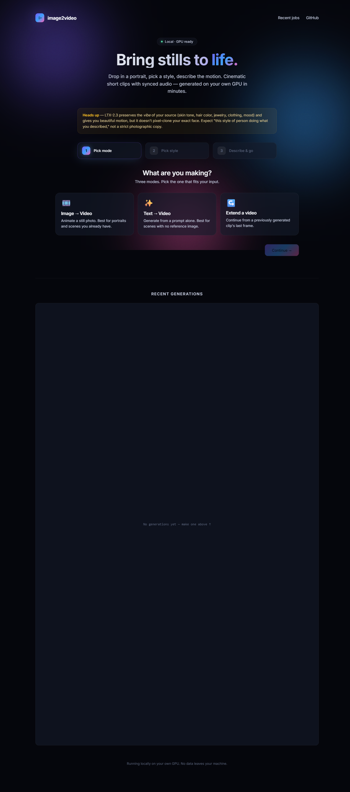
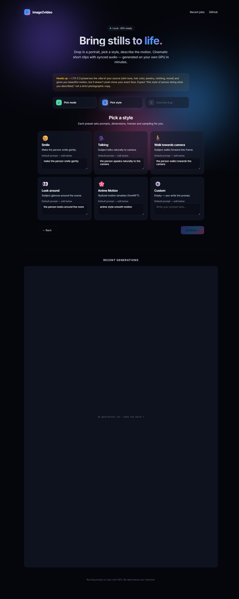
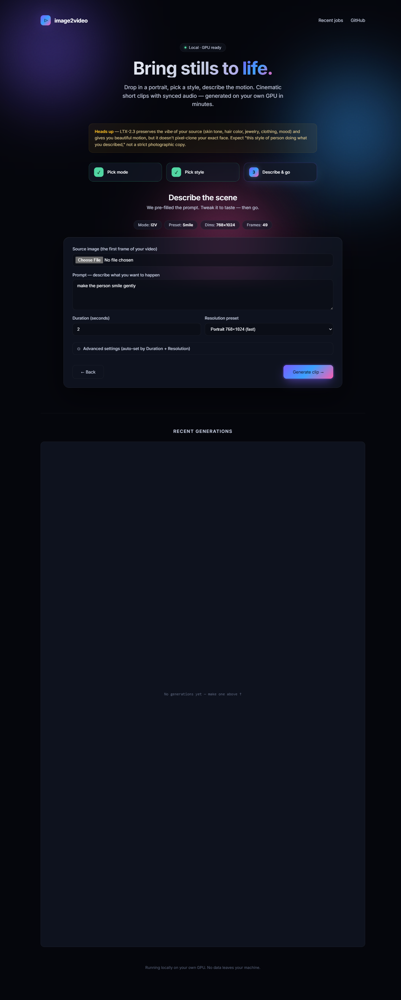

# image2video

Local image-to-video and text-to-video web app, running on your own GPU.
Built on **LTX-2.3** with the community **10Eros** fine-tune and
**Vantage's I2V workflow**, plus optional cloud deployment via Lightning AI.

  

Drop in a portrait, pick a style, type what should happen — get back a
cinematic short clip with synced audio.

## Walkthrough

### 1 · Pick what to make


Image-to-Video animates a still photo, Text-to-Video starts from a prompt
alone, Extend continues a previously generated clip from its last frame.

### 2 · Pick a style preset (with editable prompt)


Each preset ships with a short default prompt you can edit right on the
card before continuing. Optional anime stylization is one of the presets.

### 3 · Describe & go


Set duration in seconds (auto-converted to frames), pick a resolution
preset, upload your source image, tweak the prompt if needed, hit
Generate. Advanced settings (negative prompt, seed, dims) collapse out
of the way until you need them.

## What you get

| Mode | Input | Output |
|---|---|---|
| **Image → video** | source image + motion prompt | MP4 (1–4 sec) |
| **Text → video** | prompt only | MP4 (1–4 sec) |
| **Extend** | a prior generated MP4 + continuation prompt | longer MP4, last-frame chained |

UI is a 3-step wizard (mode → style preset → prompt) — full design built
on the same patterns as the sibling `face-swap-streamer` project (aurora
animated background, glass-morphism cards, spinning ring loaders, gallery
of recent generations).

## Two install paths

```text
                ┌──────────────────────────┐    ┌─────────────────────────┐
                │   Local Windows + 4090   │    │  Lightning AI Studio    │
                │   (path A — main)        │    │  (path B — cloud GPU)   │
                ├──────────────────────────┤    ├─────────────────────────┤
                │  setup.ps1 → 15-20 min   │    │  10eros_lightning.ipynb │
                │  webapp.py on :8080      │    │  Gradio on :7860        │
                │  ComfyUI on :8188        │    │  ComfyUI on :8188       │
                └──────────────────────────┘    └─────────────────────────┘
```

Full instructions live in [INSTALL.md](INSTALL.md).

### Quickstart (local)

```powershell
git clone https://github.com/dlmastery/image2video.git
cd image2video
.\setup.ps1                                  # 15-20 min; ~24 GB models

# Tab 1 — boot ComfyUI
$env:PYTORCH_CUDA_ALLOC_CONF = "expandable_segments:True"
conda run -n img2vid --no-capture-output python comfyui/main.py --listen 127.0.0.1 --port 8188

# Tab 2 — boot the webapp
conda run -n img2vid --no-capture-output python webapp.py
# open http://localhost:8080/
```

### Quickstart (Lightning AI)

1. Launch a Studio from the **Clean ComfyUI Template** (any L40s+ GPU)
2. Upload `notebooks/10eros_lightning.ipynb`
3. Run cells top-to-bottom (~12 min on first run for ~24 GB downloads)
4. Forward port 7860 via Lightning's Custom Port plugin

## Architecture

```
browser ──→ Flask :8080 ────→  ComfyUI :8188 ──→  GPU (LTX-2.3 + 10Eros)
            (3-step wizard)    (Vantage workflow)
            │
            /generate/i2v
            /generate/t2v
            /extend/<parent>
            /jobs.json
            /job/<id>/...
```

The webapp owns:
- Upload form + parameter wizard
- Per-job state + output file serving
- Optional Qwen prompt enhancer (LLM polishes terse user prompts)

ComfyUI owns:
- The actual diffusion sampling (Vantage I2V workflow)
- All model loading / VAE encode-decode / face-anchoring nodes
- Audio mux via embedded ffmpeg

The webapp converts Vantage's UI-format workflow JSON to API format on
the fly via `tools/ui_to_api.py`, then patches it per-job (source image,
prompt, dims, seed, OmniNFT strength, CFG schedule).

## Honest about face consistency

This pipeline preserves the **vibe** of your source (skin tone, hair color,
jewelry style, clothing) and gives you smooth motion — but it does
**NOT pixel-clone your exact face**. That's a structural limit of
LTX-2.3 + Vantage's `LikenessGuide` (which masks 81% of source latent
with noise via `silent_reference` mode).

For pixel-identity preservation, your options are:

1. Train a **character LoRA** (5-10 min one-time on 8-15 photos)
2. Switch to **Wan 2.2** (TenStrip's own recommendation for face consistency)
3. Explore the untouched dials: `placement_mode='keyframe'` +
   `reference_mask_mode='whole_frame'` (probe script in `out/`)

This is intentional design from the Vantage workflow — the face
anchoring is for **frame-to-frame consistency** within a clip, not
strict source-photo cloning.

## What's where

```
image2video/
├── webapp.py                               # Flask app (3-step wizard, port 8080)
├── notebooks/
│   ├── 10eros_lightning.ipynb              # Lightning AI cloud setup
│   └── run_10eros_lightning.py             # Same logic, no Jupyter required
├── workflows/
│   ├── Vantage-10Eros_I2V_v3.2.json        # Main workflow (UI format)
│   ├── Vantage-10Eros_I2V_v3.2.api.json    # Converted API format
│   ├── AICHUCKY_Ltx2.3.json                # Reference vanilla LTX-2.3 I2V
│   └── ltx23face.json                      # TenStrip face-consistency reference
├── tools/
│   └── ui_to_api.py                        # UI → API workflow converter
├── setup.ps1                               # One-shot Windows installer
├── INSTALL.md                              # Full install guide
└── README.md                               # This file
```

`comfyui/`, `models/`, `out/`, `image2video_jobs/` are gitignored —
per-machine state regenerated by `setup.ps1` or at runtime.

## Models used

| Slot | File | Size | Source |
|---|---|---|---|
| UNET | `10Eros_v1-Q4_K_M.gguf` | 14 GB | `vantagewithai/LTX2.3-10Eros-GGUF` |
| Text encoder 1 (Gemma) | `gemma-3-12b-it-orthogonal-reflection-bounded-ablation-v4-12B-fp4_mixed.safetensors` | 9 GB | `inflatebot/...` |
| Text encoder 2 (LTX) | `10Eros_v1_text_encoder.safetensors` | 2.3 GB | `vantagewithai/LTX2.3-10Eros-Split` |
| Video VAE | `10Eros_v1_vae.safetensors` | 1.45 GB | same |
| Audio VAE | `10Eros_v1_audio_vae.safetensors` | 0.36 GB | same |
| Style LoRA | `OmniNFT_converted_lora.safetensors` | 1.2 GB | `VasiliyWeb/OmniNFT_ComfyUI` |
| Spatial upscaler | `ltx-2.3-spatial-upscaler-x2-1.1.safetensors` | 1 GB | `Lightricks/LTX-2.3` |
| Audio companion | `MelBandRoformer_fp16.safetensors` | 1 GB | `Kijai/MelBandRoFormer_comfy` |

## Required custom nodes

ComfyUI custom node packs (installed by `setup.ps1`):

- `kijai/ComfyUI-KJNodes` — `LTXVImgToVideoInplaceKJ`, `ImageResizeKJv2`
- `city96/ComfyUI-GGUF` — `UnetLoaderGGUF`, `DualCLIPLoaderGGUF`
- `Lightricks/ComfyUI-LTXVideo` — official LTX-2 nodes
- `TenStrip/10S-Comfy-nodes` — `LTXFaceDetector`, `LTXLikenessGuide`,
  `LTXLikenessAnchor`, `LTXLatentAnchorAware`, `STGGuiderAdvanced`
- `rgthree/rgthree-comfy` — `Power Lora Loader`
- `pythongosssss/ComfyUI-Custom-Scripts` — `MathExpression`
- `kijai/ComfyUI-MelBandRoFormer` — audio
- `Kosinkadink/ComfyUI-VideoHelperSuite` — video I/O
- `ClownsharkBatwing/RES4LYF`, `melMass/comfy_mtb`,
  `Suzie1/ComfyUI_Comfyroll_CustomNodes` — supporting

Plus `mediapipe==0.10.13` pinned (10S-Comfy-nodes uses the removed
`mp.solutions` API).

## Troubleshooting

See [INSTALL.md → Troubleshooting](INSTALL.md#troubleshooting) for the
full matrix. Top three:

| Symptom | Fix |
|---|---|
| Sampler running at 5+ min/step | Close other GPU processes (Norton, Chrome). `nvidia-smi` should show ComfyUI as sole major user. |
| `CUDA error: out of memory` mid-run | Restart ComfyUI process to clear the pool. |
| Output looks like anime / generic | OmniNFT slider should be **0** for photoreal; default Vantage value is 0.8 anime. |

## Operator manual

For agents (Claude Code, Cursor, etc.) and engineers working on this
repo: see [CLAUDE.md](CLAUDE.md).

## License

MIT.
